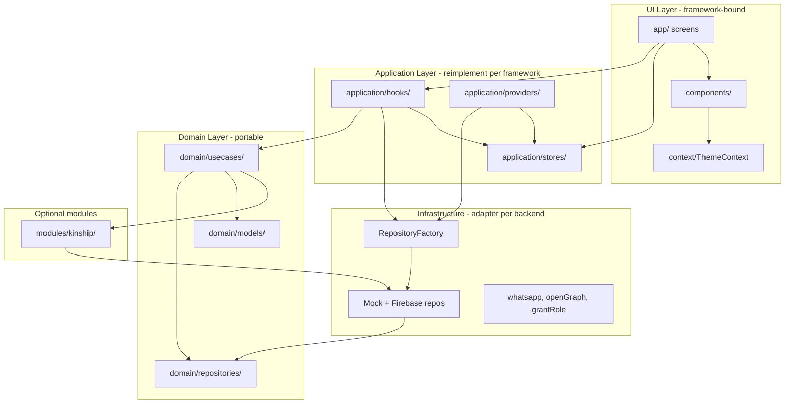
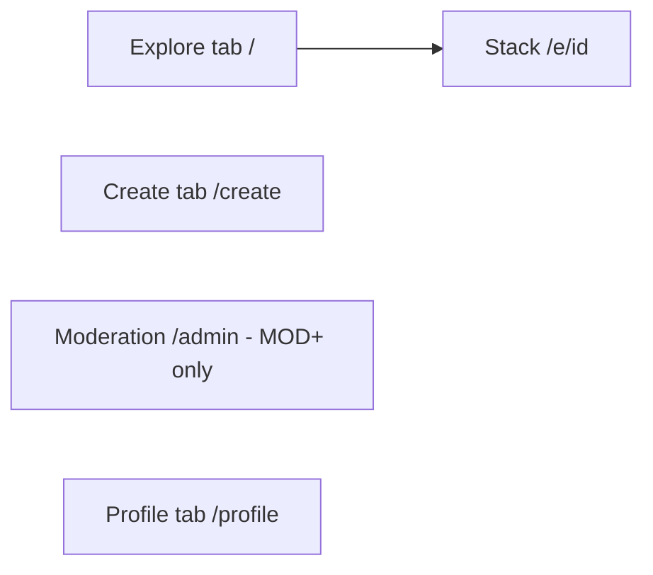
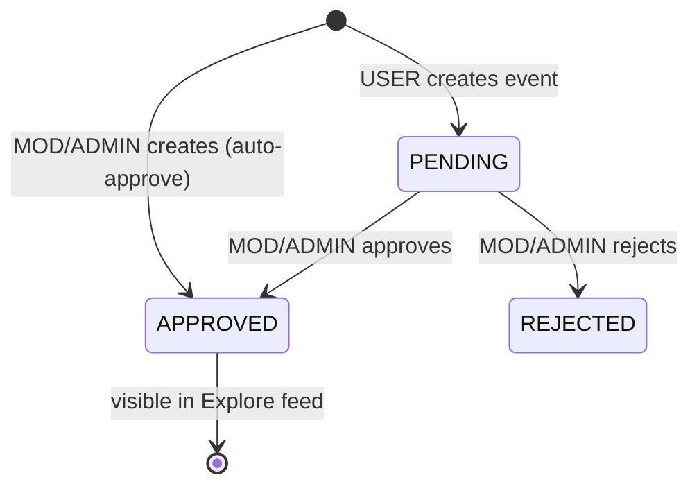

# Architecture Blueprint

## Layer diagram

## Layer rules

| Layer | Path | May import | Must not import |
|-------|------|------------|-----------------|
| UI | `app/`, `components/` | application, domain types, context | Firebase SDK directly |
| Application | `application/` | domain, infrastructure factory | UI components |
| Domain | `domain/` | `modules/kinship` domain only (CreateEvent) | React, Firebase, Expo |
| Infrastructure | `infrastructure/`, `config/` | domain interfaces | UI, React hooks |
| Modules | `modules/kinship/` | own domain + infra | app screens |

## Backend switching

`RepositoryFactory` (`infrastructure/factory/RepositoryFactory.ts`) selects implementations:

| `EXPO_PUBLIC_BACKEND_PROVIDER` | Event | Auth | User |
|--------------------------------|-------|------|------|
| unset / `mock` | `MockEventRepository` | `MockAuthRepository` | `MockUserRepository` |
| `firebase` | `FirebaseEventRepository` | `FirebaseAuthRepository` | `FirebaseUserRepository` |

Kinship: `KinshipRepositoryFactory` mirrors the same env flag.

## Navigation (Expo Router)

- Tab bar: floating, absolute bottom (`app/(tabs)/_layout.tsx`)
- Admin tab hidden when `href: null` for USER role

## Backend surfaces

| Surface | Path | Role |
|---------|------|------|
| Firestore rules | `firestore.rules` | Security model |
| Firestore indexes | `firestore.indexes.json` | Category + pagination queries |
| Cloud Functions | `functions/src/` | `grantRole`, `eventSharePage`, `whatsappWebhook` |
| Supabase (optional) | `supabase/schema.sql` | Alternate SQL + RLS schema |
| EAS / OTA | `eas.json`, `app.json` | Manual release profiles |

## Firestore collections (conceptual)

| Collection | Purpose |
|------------|---------|
| `events` | Community events; `status`: PENDING → APPROVED \| REJECTED |
| `rsvps` | Per-user RSVP documents |
| `users` | Profile + role (synced with Auth custom claims) |
| `persons`, `relationships`, `villages` | Kinship module |
| `templates` | Event invitation templates (ADMIN write) |

## Event lifecycle

## Root providers (`app/_layout.tsx`)

Order: `SafeAreaProvider` → `ThemeProvider` → `QueryClientProvider` (persisted) → `AuthBootstrap` → `UpdatesBootstrap` → `FluidAuroraBackground` → `OfflineBanner` → Stack/Tabs.

## Optional follow-up

- Publish `domain/` + kinship domain as `@community-connect/core` npm package
- Generate OpenAPI-style YAML from repository interface method signatures
