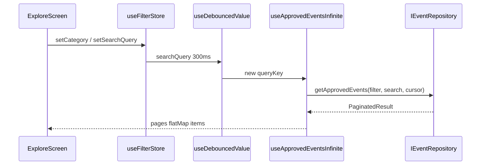
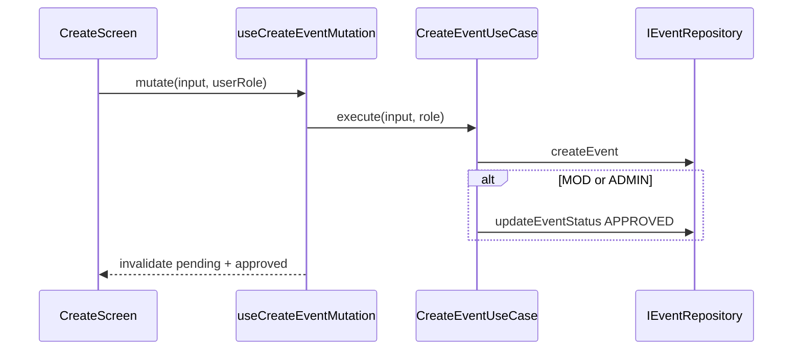
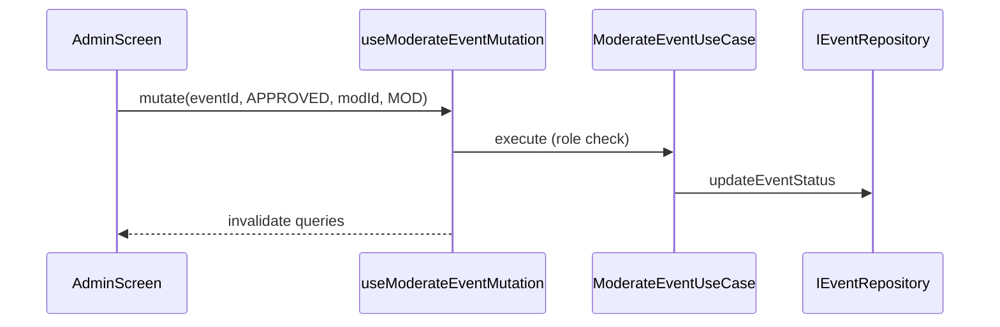
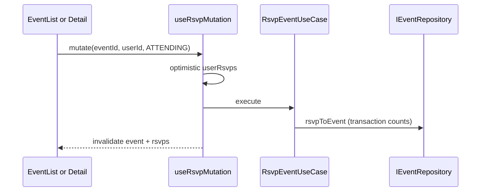
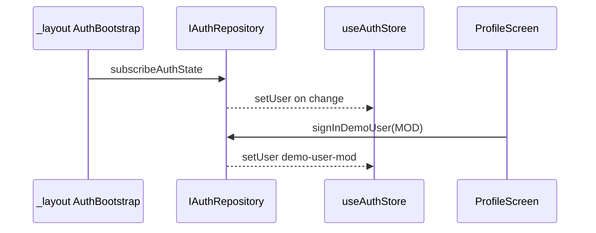

# Application Layer Blueprint

What lives between UI and domain in the current React Native app. **Reimplement** with your framework's state/async patterns.

Source: `application/`

---

## Zustand stores

### `useAuthStore` (`application/stores/useAuthStore.ts`)

| Field / action | Type | Notes |
|--------------|------|-------|
| `user` | `User` | Default demo ADMIN |
| `setUser(user)` | — | Auth bootstrap hydration |
| `setRole(role)` | — | Local demo only (prefer `signInDemoUser`) |

### `useFilterStore` (`application/stores/useFilterStore.ts`)

| Field / action | Type | Default |
|--------------|------|---------|
| `category` | string | `'ALL'` |
| `searchQuery` | string | `''` |
| `setCategory` | — | |
| `setSearchQuery` | — | |

Not persisted. Explore screen only.

---

## React Query catalog (`application/hooks/useEventsQuery.ts`)

| Hook | Query key | staleTime | Notes |
|------|-----------|-----------|-------|
| `useApprovedEvents` | `['approvedEvents', category, search]` | 5 min | Flat list (legacy) |
| `useApprovedEventsInfinite` | `['approvedEvents', 'infinite', category, search]` | 5 min | Cursor pagination |
| `usePendingEvents` | `['pendingEvents']` | 30 sec | Moderation queue |
| `useEventDetail` | `['event', id]` | 5 min | |
| `useUserRsvps` | `['userRsvps', userId]` | 5 min | Shared across tabs |

### Mutations

| Hook | Use case | Optimistic | Invalidates |
|------|----------|------------|-------------|
| `useCreateEventMutation` | CreateEvent | no | approved*, pending* |
| `useModerateEventMutation` | ModerateEvent | no | approved*, pending* |
| `useRsvpMutation` | RsvpEvent | yes (`userRsvps`) | userRsvps, event, approved* |

`*` prefix invalidation on query key families.

**Persistence:** `@tanstack/react-query-persist-client` + MMKV (`infrastructure/storage/mmkvStorage.ts`).

---

## Other hooks

| Hook | Purpose |
|------|---------|
| `useDebouncedValue(value, 300)` | Explore search debounce |
| `useRoleGuard()` | `isUser`, `isMod`, `isAdmin` from auth store + `hasPermission` |
| `useNetworkGuard()` | NetInfo → show `OfflineBanner` |
| `useLayoutInsets()` | `contentBottomPadding` for floating tab bar |

---

## Providers

| Provider | Role |
|----------|------|
| `AuthBootstrap` | `subscribeAuthState` → `setUser` on boot |
| `UpdatesBootstrap` | Expo OTA check (framework-specific) |

---

## Critical data flows

### 1. Filter/search → approved feed

**Tests:** `EventsFilter.integration.test.tsx`, `EventsInfinite.integration.test.tsx`, `e2e/web-smoke.spec.ts`

### 2. Create event → pending queue

**Tests:** `CreateEvent.integration.test.tsx`, `e2e/regression.spec.ts` (create as USER)

### 3. Moderate → approved feed

**Tests:** `Moderate.integration.test.tsx`, `e2e/regression.spec.ts`

### 4. RSVP → count updates

**Tests:** `Rsvp.integration.test.tsx`, `e2e/regression.spec.ts`

### 5. Auth bootstrap → role switch

**Tests:** `AuthBootstrap.integration.test.tsx`, `e2e/regression.spec.ts` (USER hides Moderation)

---

## UI vs use-case gates

| Gate | UI only | Use case enforced |
|------|---------|-------------------|
| Moderation tab visible | `useRoleGuard` + tab `href` | `ModerateEventUseCase` |
| Create auto-approve | — | `CreateEventUseCase` |
| Role grant | — | `ManageRoleUseCase` |

Always enforce business rules in domain; UI gates are convenience only.
