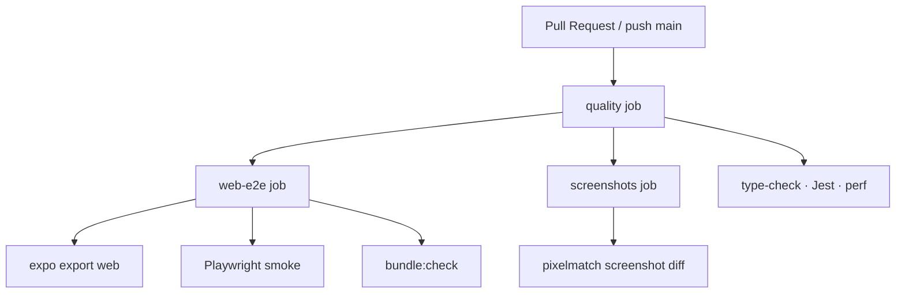

# CI/CD Plan — Community Connect

**Last updated:** 2026-08-12  
**Stack:** Expo SDK 55 · React 19 · RN 0.83 · Playwright · Jest

**Active automation:** GitHub Actions only — single workflow [`.github/workflows/ci.yml`](../.github/workflows/ci.yml).  
Maestro self-hosted, EAS release, and legacy hybrid workflows are **disabled** (manual / local only).

---

## Goals

1. **Every PR** gets fast Linux feedback on GitHub-hosted runners.
2. Native Maestro, EAS Build/Submit, and Firebase deploy stay **manual** until explicitly re-enabled.
3. Detox / Chromatic / Fastlane remain deferred.

---

## Active pipeline (`ci.yml`)



| Job | Runner | Steps |
|-----|--------|-------|
| `quality` | `ubuntu-latest` | `npm ci` · type-check · `npm test` · `test:perf` |
| `web-e2e` | `ubuntu-latest` | `build:web` · `bundle:check` · Playwright |
| `screenshots` | `ubuntu-latest` | candidate PNGs · pixelmatch · artifact upload |

Triggers: all `pull_request` events; push to `main` / `develop`.

---

## Workflow inventory

| File | Status |
|------|--------|
| **`ci.yml`** | ✅ **Enabled** — sole active pipeline |
| `quality.yml` | ⛔ Disabled (`workflow_dispatch` + `if: false`) |
| `web-e2e.yml` | ⛔ Disabled (merged into `ci.yml`) |
| `ui-screenshots.yml` | ⛔ Disabled (merged into `ci.yml`) |
| `maestro-native.yml` | ⛔ Disabled — run Maestro locally |
| `release.yml` | ⛔ Disabled — run EAS manually |
| `cicd.yml` | ⛔ Disabled — legacy stub |

---

## Stage details (active)

### Quality

| Step | Command |
|------|---------|
| Install | `npm ci` (`.npmrc` → `legacy-peer-deps=true`) |
| Types | `npm run type-check` |
| Tests | `npm test` |
| Perf | `npm run test:perf` |

### Web E2E

| Step | Command |
|------|---------|
| Build | `npm run build:web` |
| Bundle | `npm run bundle:check` |
| E2E | `npm run test:e2e` |

### Screenshots

| Step | Command |
|------|---------|
| Candidate | `npm run screenshots:candidate` |
| Diff | `npm run screenshots:compare` |

---

## Disabled / manual-only

| Capability | How to run locally |
|------------|--------------------|
| Maestro iOS/Android | `npm run screenshots:native:ios` / `screenshots:native:android` — see `docs/testing/MAESTRO_CI.md` |
| EAS production build | `eas build --profile production --platform all` |
| EAS OTA | `eas update --channel production --message "..."` |
| Firebase Functions | `cd functions && npm run build && firebase deploy --only functions` |

`eas.json` and Maestro YAML remain in-repo for when you re-enable those paths.

---

## Required branch checks

Protect the default branch with this single check:

- **CI** → jobs: `quality`, `web-e2e`, `screenshots` (or the workflow as a whole)

---

## Local parity

```bash
npm ci
npm run type-check
npm test
npm run test:perf
npm run build:web
npm run bundle:check
npm run test:e2e
npm run screenshots:candidate && npm run screenshots:compare
```

---

## Related docs

| Doc | Topic |
|-----|-------|
| `docs/testing/TESTING_STRATEGY.md` | Test inventory |
| `docs/testing/MAESTRO_CI.md` | Local Maestro (CI disabled) |
| `docs/testing/DETOX_EVALUATION.md` | Detox deferred |
| `eas.json` | Profiles for manual EAS releases |
