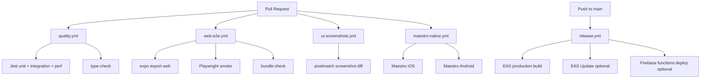

# CI/CD Plan — Community Connect

**Last updated:** 2026-08-12  
**Stack:** Expo SDK 55 · React 19 · RN 0.83 · EAS · Firebase · Maestro · Playwright

This plan replaces the legacy Fastlane-centric hybrid sketch in older `cicd.yml` comments.  
**Source of truth for workflows:** `.github/workflows/` · **Release builds:** `eas.json`

---

## Goals

1. **Every PR** gets fast Linux feedback (unit, integration, perf, web E2E, screenshot diff, bundle gate).
2. **Native fidelity** runs on self-hosted macOS via Maestro (when a runner is registered).
3. **Releases** ship through **EAS Build / Submit / Update** — not Fastlane.
4. **Detox** and **Chromatic/Percy** stay deferred unless product needs force re-evaluation.

---

## Pipeline overview



---

## Workflow map

| Workflow | Trigger | Runner | Purpose | Status |
|----------|---------|--------|---------|--------|
| `quality.yml` | PR + push `main` | `ubuntu-latest` | `npm ci`, type-check, Jest, perf | ✅ Active |
| `web-e2e.yml` | PR (app/components/e2e) | `ubuntu-latest` | Web export, Playwright, bundle gate | ✅ Active |
| `ui-screenshots.yml` | PR (UI paths) | `ubuntu-latest` | Viewport PNGs + pixelmatch | ✅ Active |
| `maestro-native.yml` | PR (app/UI/maestro) | `[self-hosted, macOS, ARM64]` | Native smoke + screenshots | ✅ Active (needs runner) |
| `release.yml` | Push `main` / manual | `ubuntu-latest` | EAS build/update + optional Functions | ✅ Active (needs secrets) |

Legacy file: `.github/workflows/cicd.yml` is a **pointer stub** only — do not re-enable Fastlane jobs.

---

## Stage 1 — PR quality gate (cloud Linux)

**Expectation:** fail the PR if any of these fail.

| Step | Command | Why |
|------|---------|-----|
| Install | `npm ci` (uses `.npmrc` `legacy-peer-deps=true` for Expo 55) | Reproducible installs |
| Types | `npm run type-check` | Catch TS regressions early |
| Unit + integration | `npm test` | Domain, hooks, screens, RSVP, auth |
| Perf budgets | `npm run test:perf` | Explore mount + FlashList budgets |

Optional later: gitleaks / Semgrep as non-blocking or required once secrets policy is ready.

---

## Stage 2 — Web export & E2E (cloud Linux)

| Step | Command | Why |
|------|---------|-----|
| Build | `npm run build:web` | Validates Expo 55 web export |
| Bundle | `npm run bundle:check` | 4 MB JS budget |
| E2E | `npm run test:e2e` | Playwright smoke (tabs, search, profile) |

---

## Stage 3 — Visual regression (cloud Linux)

| Step | Command | Why |
|------|---------|-----|
| Candidate PNGs | `npm run screenshots:candidate` | iPhone + Pixel viewports via Playwright |
| Diff | `npm run screenshots:compare` | `pixelmatch` vs committed references |

Artifacts upload under `docs/screenshots/.ci-candidate/` for review.

---

## Stage 4 — Native smoke (self-hosted Mac)

See `docs/testing/MAESTRO_CI.md`.

| Platform | Command |
|----------|---------|
| iOS | `maestro test .maestro/ios/screenshots.yaml` |
| Android | `maestro test .maestro/android/screenshots.yaml` |

**Prerequisites:** runner labels `self-hosted` + `macOS` + `ARM64`, Maestro CLI, booted simulator/emulator with `com.community.connect` installed (`eas build -p ios --profile development` or `expo run:ios`).

If no runner is registered, GitHub marks the job as waiting/skipped — Linux PR gates still protect merges.

---

## Stage 5 — Release (EAS)

Triggered on `main` (and `workflow_dispatch`).

| Step | Tooling | Notes |
|------|---------|-------|
| Production binary | `eas build --profile production --platform all --non-interactive` | Requires `EXPO_TOKEN` |
| Store submit | `eas submit --profile production` | Optional; needs ASC + Play secrets |
| OTA JS patch | `eas update --channel production --message "..."` | For JS-only fixes; runtimeVersion = appVersion |
| Cloud Functions | `firebase deploy --only functions` | Optional; `FIREBASE_TOKEN` |

### EAS profiles (`eas.json`)

| Profile | Audience | Channel |
|---------|----------|---------|
| `development` | Dev clients + simulators | `development` |
| `preview` | Internal QA APK / devices | `preview` |
| `production` | Store / production OTA | `production` |

Replace `YOUR_EAS_PROJECT_ID` in `app.json` after `eas init`.

---

## Secrets checklist

| Secret | Used by | Required for |
|--------|---------|--------------|
| `EXPO_TOKEN` | `release.yml` | EAS build / update / submit |
| `FIREBASE_TOKEN` | `release.yml` | Functions deploy |
| `APP_STORE_CONNECT_API_KEY*` | EAS submit iOS | Store upload |
| Play service account JSON | EAS submit Android | Internal track |
| `META_WA_*` / `EXPO_PUBLIC_META_WA_*` | Runtime / Functions | Live WhatsApp Cloud (not CI) |

---

## What we explicitly do **not** run in CI

| Item | Reason |
|------|--------|
| Fastlane lanes | Replaced by EAS Build / Submit |
| Detox | Deferred — see `docs/testing/DETOX_EVALUATION.md` |
| Chromatic / Percy | Optional SaaS; pixelmatch covers baseline |
| Full Android Gradle unit tests via `expo prebuild` | Slow; Jest covers app logic; EAS validates native builds |
| Firebase emulator suite on every PR | Local / nightly candidate; seed via `npm run seed` |

---

## Local parity commands

```bash
npm ci
npm run type-check
npm test
npm run test:perf
npm run build:web
npm run bundle:check
npm run test:e2e
npm run screenshots:candidate && npm run screenshots:compare

# Native (Mac)
npm run screenshots:native:ios
npm run screenshots:native:android

# Release (developers with EAS access)
eas build --profile preview --platform android
eas update --channel preview --message "QA build"
```

---

## Rollout checklist

- [ ] Register self-hosted Mac runner with labels `self-hosted`, `macOS`, `ARM64`
- [ ] Install Maestro on runner (`docs/testing/MAESTRO_CI.md`)
- [ ] `eas init` → set real `extra.eas.projectId` + `updates.url`
- [ ] Add `EXPO_TOKEN` to GitHub Actions secrets
- [ ] (Optional) Add `FIREBASE_TOKEN` for Functions deploy on `main`
- [ ] (Optional) Wire EAS submit credentials for store tracks
- [ ] Confirm `quality.yml` + `web-e2e.yml` + `ui-screenshots.yml` are required status checks on the default branch

---

## Related docs

| Doc | Topic |
|-----|-------|
| `docs/testing/TESTING_STRATEGY.md` | Test inventory & phases |
| `docs/testing/MAESTRO_CI.md` | Native runner setup |
| `docs/testing/DETOX_EVALUATION.md` | Why Detox is deferred |
| `docs/IMPLEMENTATION_GAP_ANALYSIS.md` | Product/platform gap status |
| `eas.json` | Build / submit profiles |
